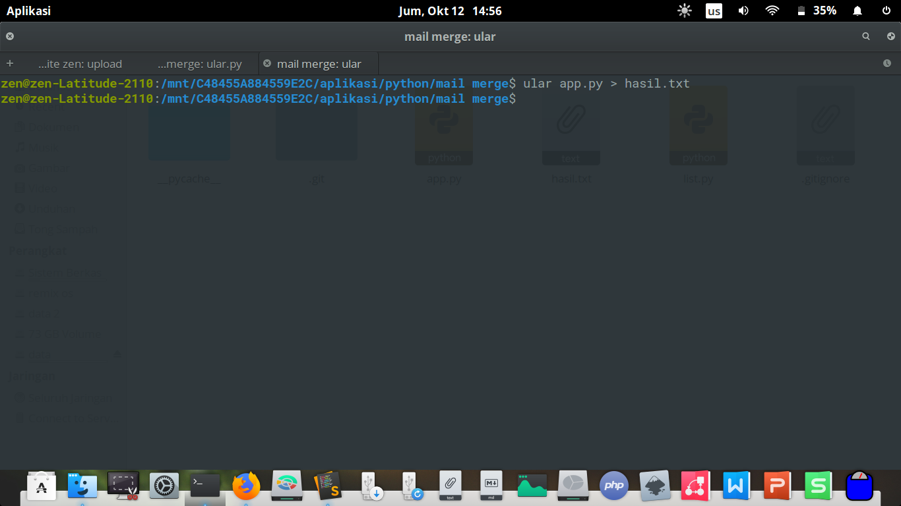

# Cara Menggunakan

Buka `list.py` kemudian edit skrip di dalamnya:

```python
nama = [
	'achmad zais',
	'agus rohadi',
	'agus salim',
	'bayu a p',
	'brian e f',
	'dandi taslimin',
	'dhimas arya adi nugroho',
	'dimas ragil bagindo',
	'dinda nurlaela',
	'edy arya putra',
	'erika',
	'heri nur',
	'latifah tansil',
	'nur mina',
	'nur nita r j',
	'nurul aisyah',
	'qonita',
	'rahman',
	'yulia putri'
]

nilai = [
	'100',
	'75',
	'94',
	'100',
	'77',
	'77',
	'100',
	'100',
	'74',
	'77',
	'94',
	'75',
	'89',
	'89',
	'100',
	'92',
	'97',
	'75',
	'75'
]
```

Buka `app.py` terus sesuaikan isinya dengan template yang kamu buat:

```python
from list import *

for n, x in enumerate(nama):
	print(f'''{nama[n]} : {nilai[n]}''')
```

Buka Terminal lalu ketik:

```bash
python3.6 app.py > hasil.txt
```